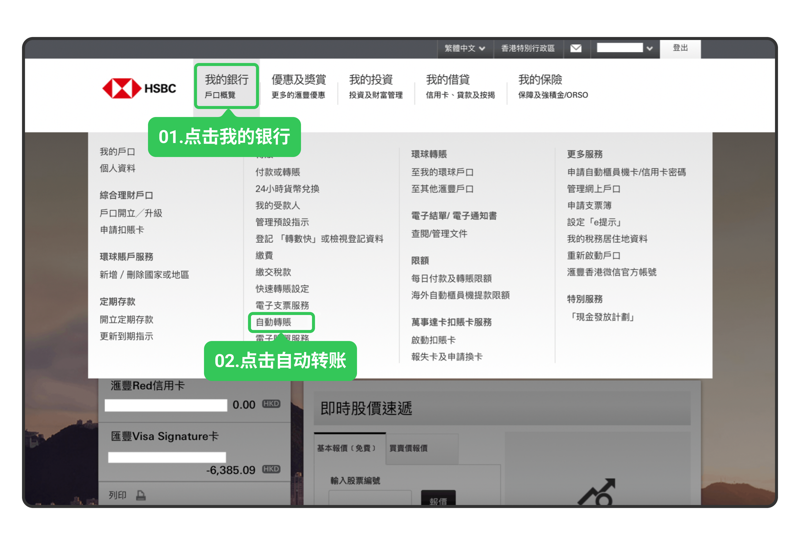
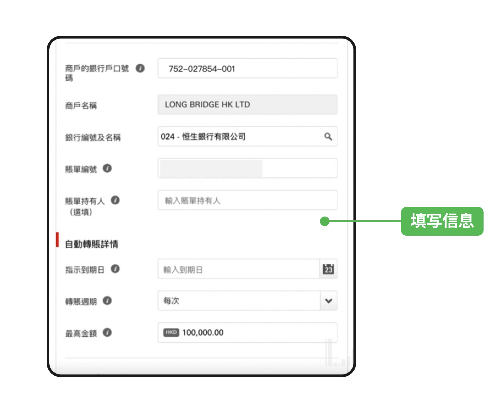
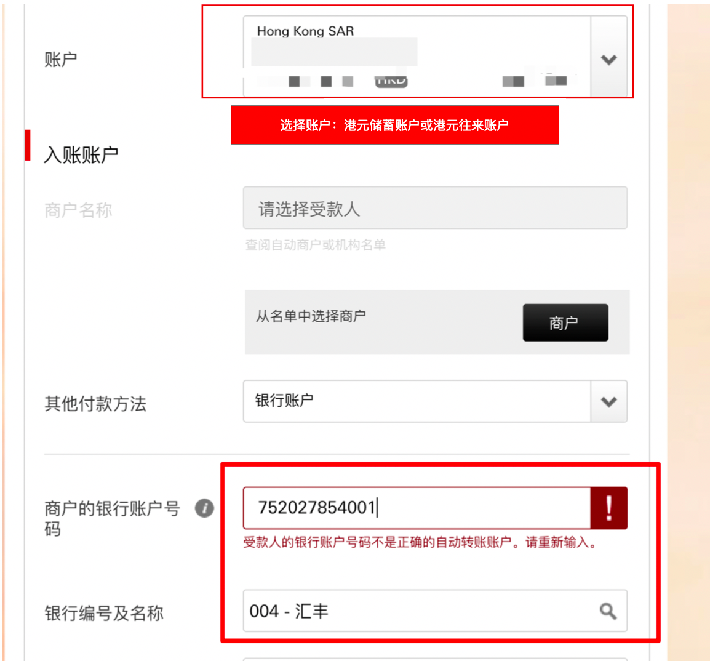
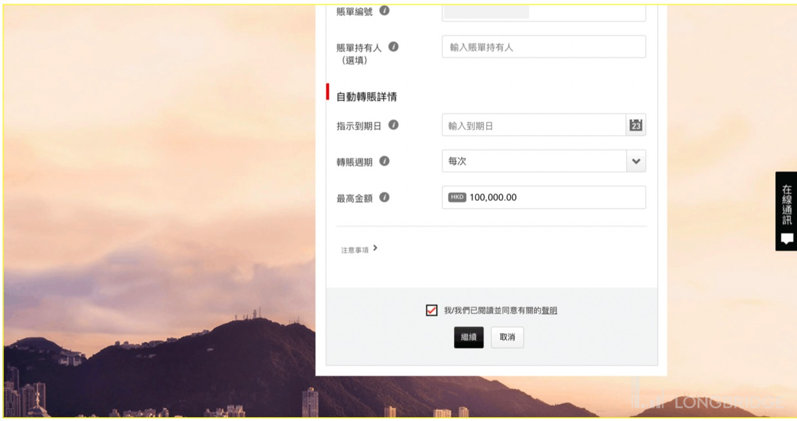
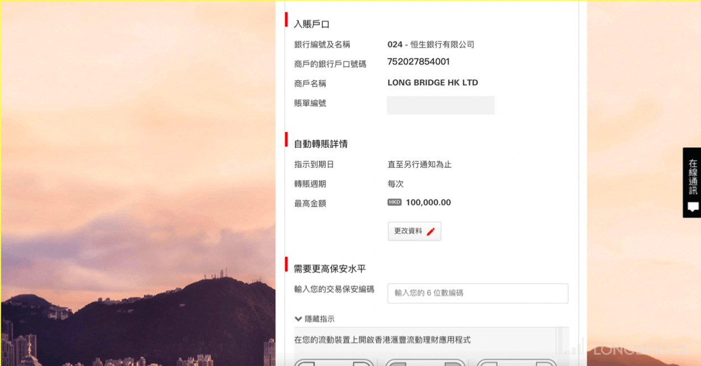
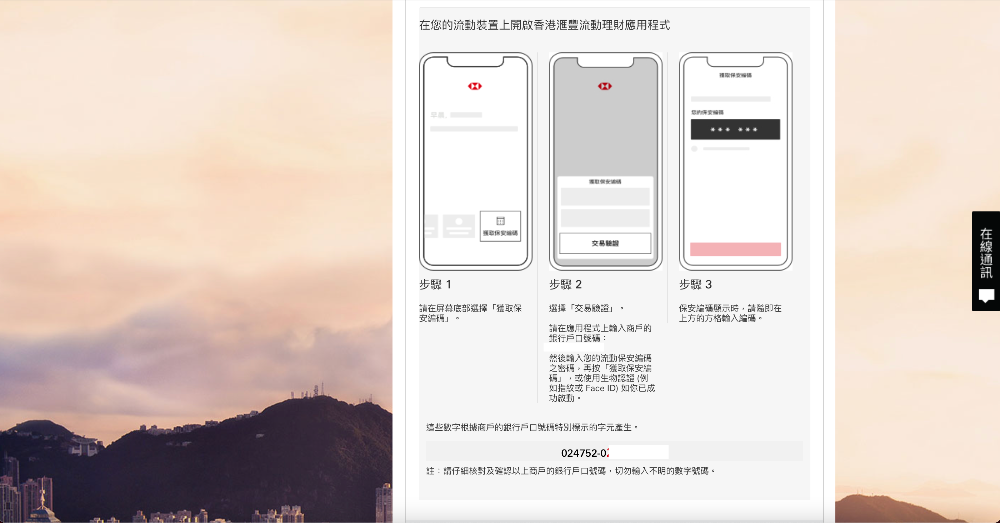
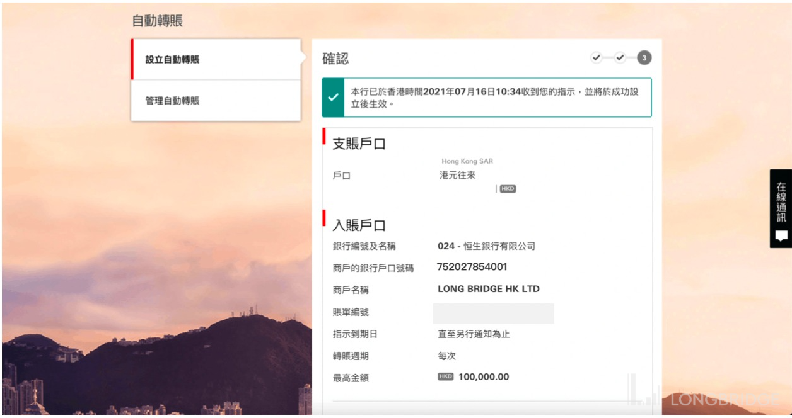

# 汇丰 eDDA

汇丰银行优先推荐在**长桥 App 内**完成 eDDA 授权。若 App 内多次授权失败，可改用网上银行授权。

eDDA 入金的到账时间、手续费及通用故障排查，见 eDDA 入金。

## 方式一：长桥 App 内授权（推荐）

按通用 eDDA 入金 流程操作即可。

**汇丰特别提示**：汇丰账户分为储蓄账户和往来账户，填写卡号时须注意： - 卡号尾数为 **888 / 833** → 储蓄账户 - 卡号尾数为 **001** → 往来账户

如不确定账户类型，可查看支票簿上的号码或致电汇丰客服确认。

## 方式二：网上银行授权（App 多次失败时使用）

1. 登入**汇丰银行网上银行** → **我的银行** → **自动转账** → **设立自动转账**

设立自动转账入口

1. 在「其他银行户口」中填写以下信息：

| 字段 | 填写内容 |
| --- | --- |
| 户口 | 确认资金所在账户（港元储蓄或往来账户），确保余额充足 |
| 商户的银行户口号码 | 752027854001 |
| 商户名称 | Long Bridge HK Limited |
| 账单编号 | 您的长桥账号（即长桥 App 授权指引页面中的「付款人编号」） |
| 银行编号及名称 | 024 - 恒生银行有限公司 |
| 最高金额 | 按需填写，建议不超过港币十万元；超过十万元需另外下载并邮寄授权书表格 |
| 到期日 | 按需设置，建议不设到期日 |

填写授权信息

**提示**：若填写时报错，建议先填「银行编号及名称」，再填「商户名称」。

填写顺序参考

1. 勾选同意相关声明，点击**继续**

同意声明

1. 核对信息无误，按网银指引获取**交易保安编码**，输入后点击**确认**

确认信息

输入保安编码

保安编码内置于**香港汇丰 App（HSBC HK App）**，无需携带实体编码器。如未安装，可在 App Store 或 Google Play 搜索「HSBC HK」下载。

HSBC HK App 获取保安编码

1. 完成授权申请

授权申请完成

## 第二步：长桥 App 发起入金

提交授权后，等待银行和长桥审批（预计 1–2 个银行工作日生效）。授权成功以银行端通知为准。

授权生效后：长桥 App → **资产** → **存入资金** → **存入港元**，选择汇丰银行卡，入金方式选择「eDDA」即可快捷入金。
