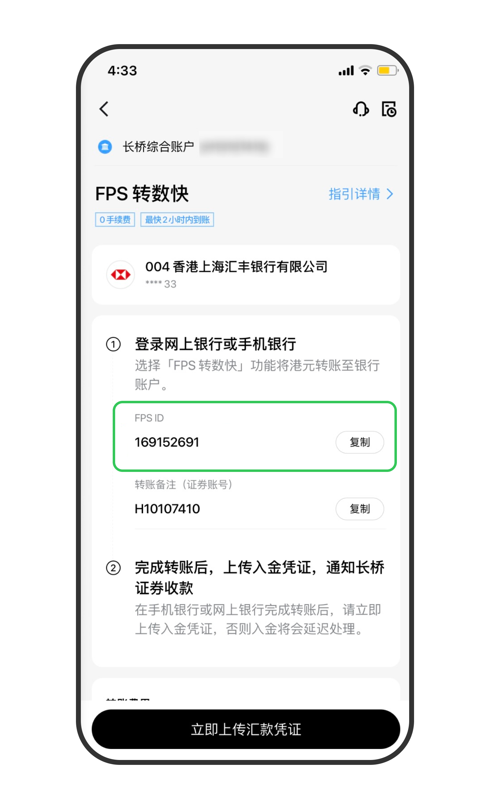
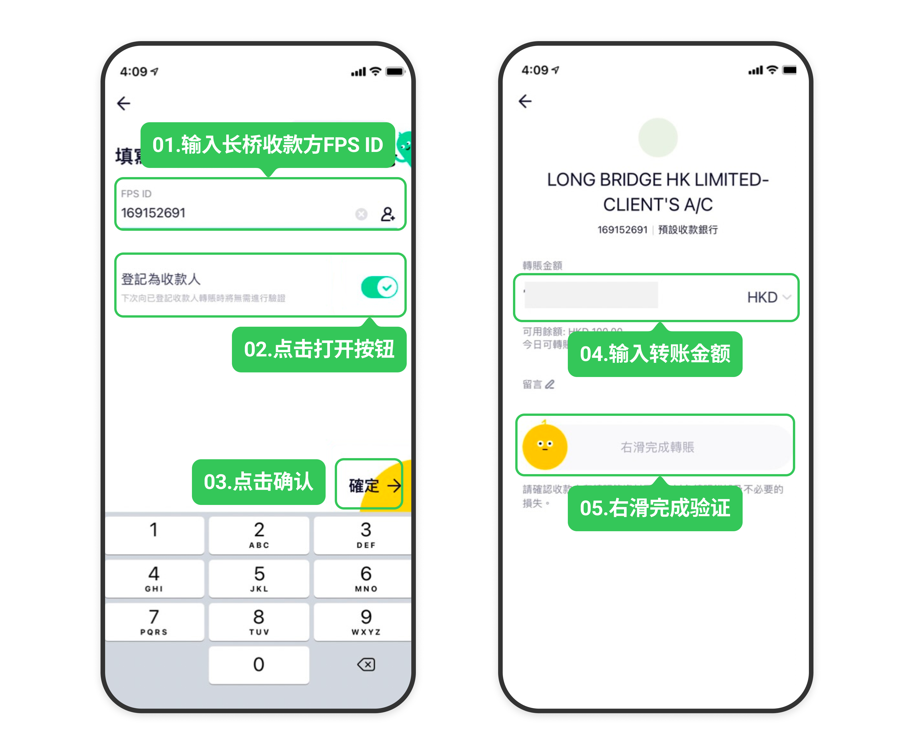
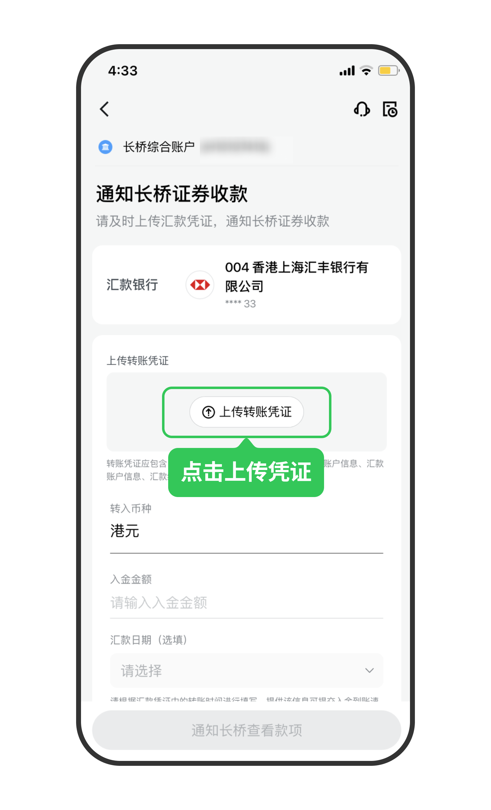

# 众安银行 FPS 转数快

通过众安银行 App 的 FPS 功能将资金转至长桥，转账完成后上传凭证即可。

FPS 入金的到账时间、手续费及通用注意事项，见 FPS 转数快入金。

## 操作步骤

1. 打开**长桥 App** → **资产** → **存入资金** → **FPS 转数快**，复制 FPS ID

| 长桥 FPS ID | 169152691 |
| --- | --- |
| 收款银行 | 中国工商银行（亚洲） |
| 收款人名称 | LONG BRIDGE HK LIMITED-CLIENT’S A/C |

1. 打开**众安银行 App** → **转账** → **FPS ID**

2. 输入长桥 FPS ID **169152691**，将「**登记为收款人**」开关打开，点击**确定**后输入转账金额，滑动验证后点击**提交**

1. 转账完成后，立即返回**长桥 App** → **资产** → **存入资金** → **FPS 转数快**，上传汇款凭证
	- 凭证必须在转账后立即上传，否则影响入金进度

