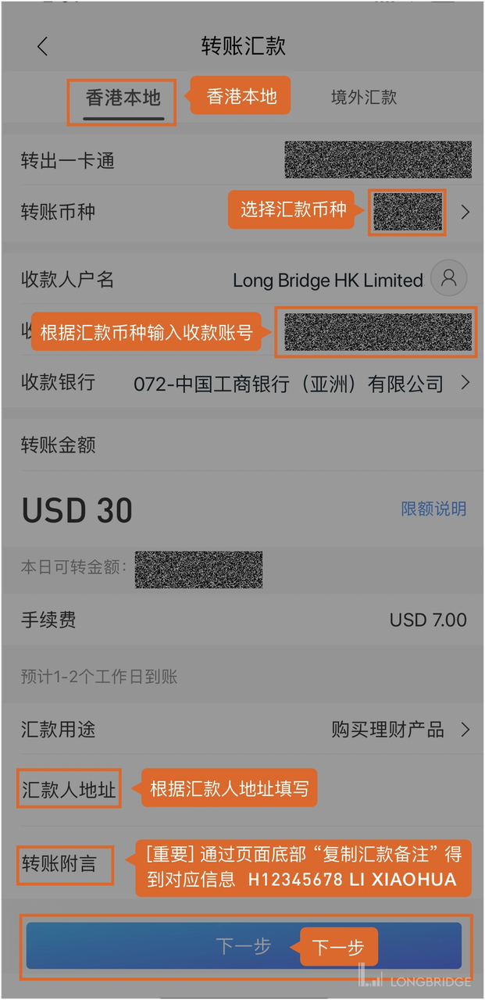
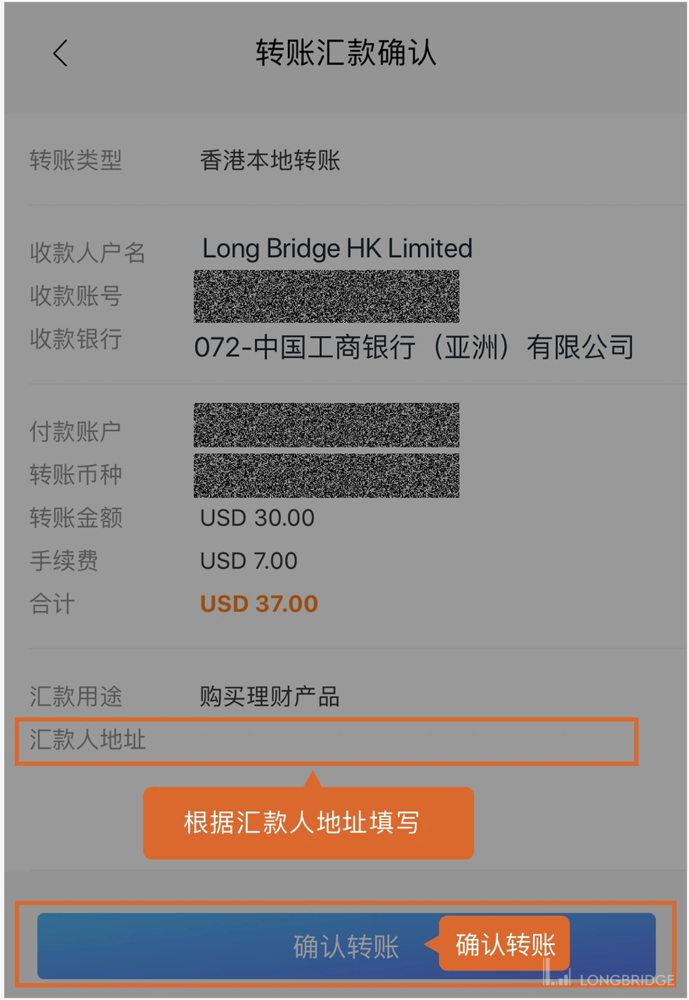
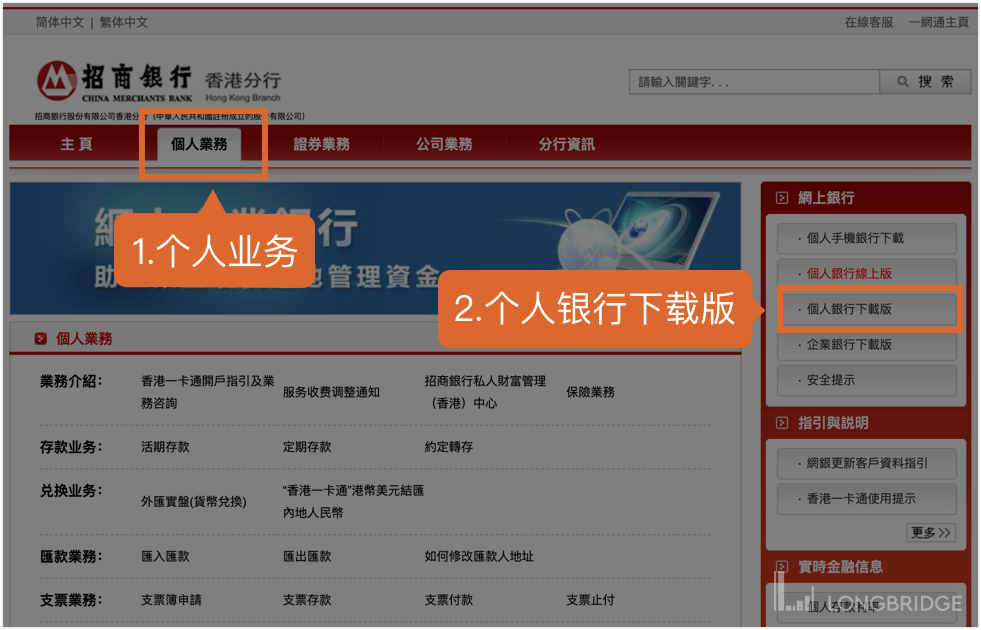
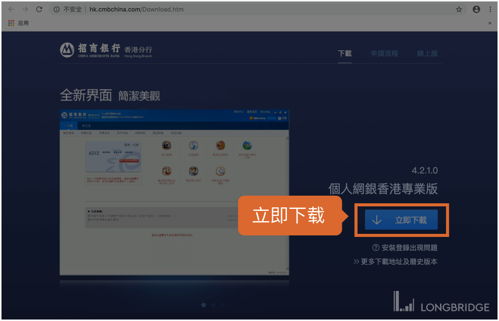
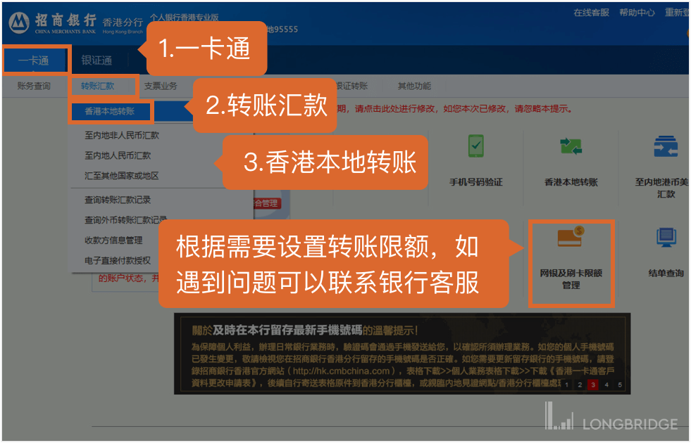
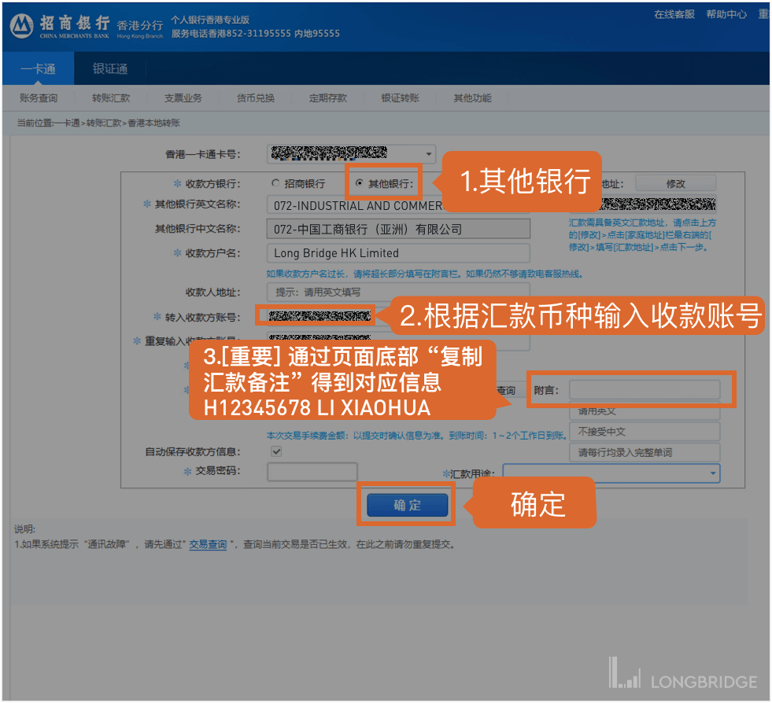
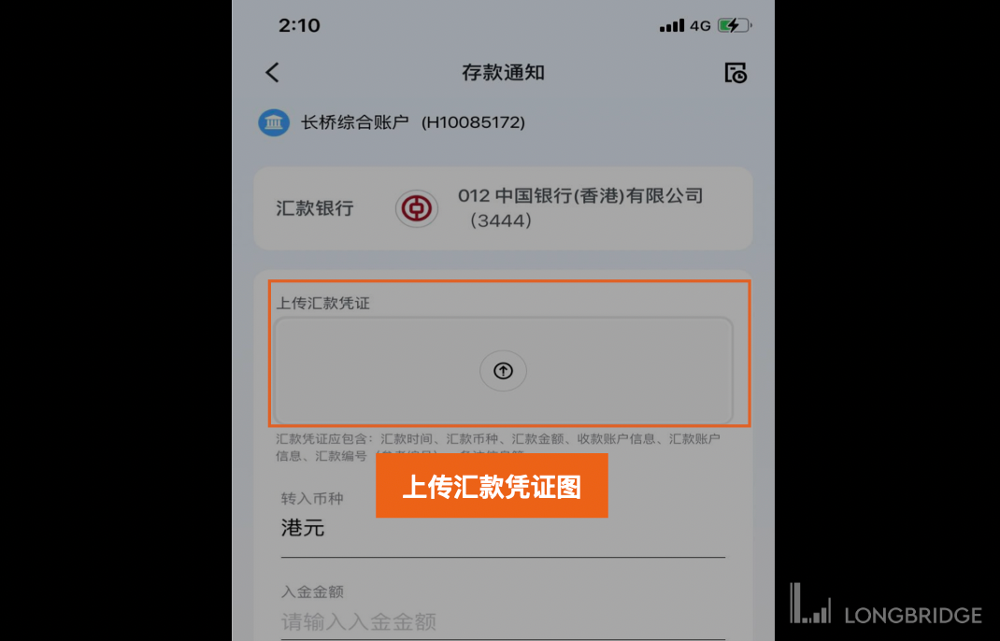

# 招行香港网银转账

通过招商银行香港手机银行或网上银行将资金转至长桥，转账完成后上传凭证即可。

网银转账的到账时间、手续费及通用注意事项，见 网银转账入金。

## 收款账户信息

**港元（工银亚洲 072）**

| 字段 | 内容 |
| --- | --- |
| 收款人名称 | Long Bridge HK Limited |
| 港元收款账号 | 861520160012 |
| 收款银行 | 中国工商银行（亚洲）有限公司 |
| 银行编号 | 072 |
| SWIFT 代码 | UBHKHKHHXXX |
| 银行地址 | 33/F, ICBC Tower, 3 Garden Road, Central, Hong Kong |

**美元（创兴银行 041）**

| 字段 | 内容 |
| --- | --- |
| 收款人名称 | Long Bridge HK Limited |
| 美元收款账号 | 256150608546 |
| 收款银行 | 创兴银行有限公司 |
| 银行编号 | 041 |
| SWIFT 代码 | LCHBHKHH |
| 银行地址 | Chong Hing Bank Centre, 24 Des Voeux Rd. Central, Hong Kong |

## 手机银行

1. 打开**招商银行 App** → 点击**首页左上角**「扫一扫」，扫描以下二维码进入**招行香港分行**界面

1. 进入**招行香港一卡通**主页面 → **转账** → **香港本地**，填写收款人信息，点击**下一步**，核对无误后点击**确认转账**，提示成功即汇款完毕

1. 立即截图保留凭证，返回**长桥 App** → **资产** → **存入资金** → **网银转账**，上传凭证
	- 凭证必须在转账后立即上传，否则影响入金进度

## 网上银行

**前置条件**：需先下载「个人银行香港专业版」PC 桌面应用。参见 招行香港 eDDA 授权入金 中的下载步骤。

1. 登录**招商银行香港分行个人网上银行**（http://hk.cmbchina.com），下载并通过**个人银行香港专业版**登录

1. 选择**一卡通** → **转账汇款** → **香港本地转账**

1. 选择**其他银行**，填写收款人信息，核对无误后点击**确定**，提示成功即汇款完毕

1. 立即截图保留凭证，返回**长桥 App** → **资产** → **存入资金** → **网银转账**，上传凭证
	- 凭证必须在转账后立即上传，否则影响入金进度

