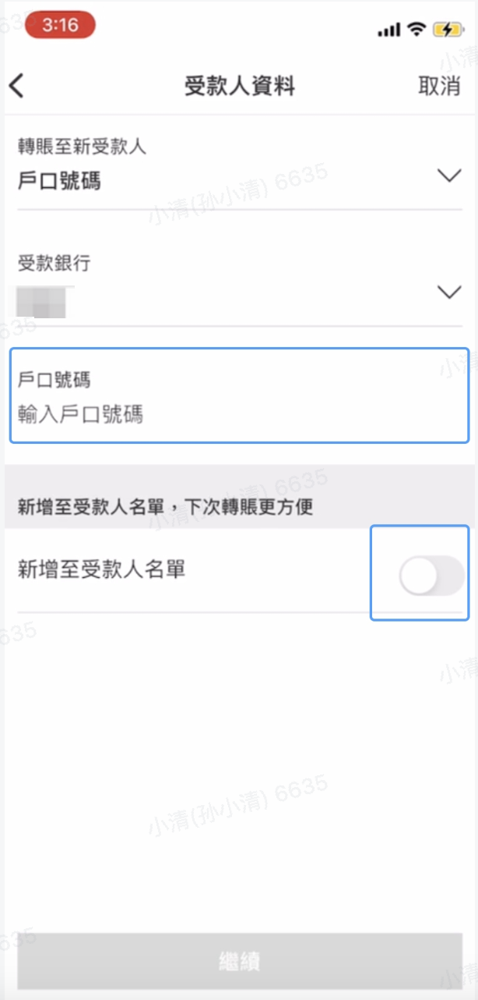
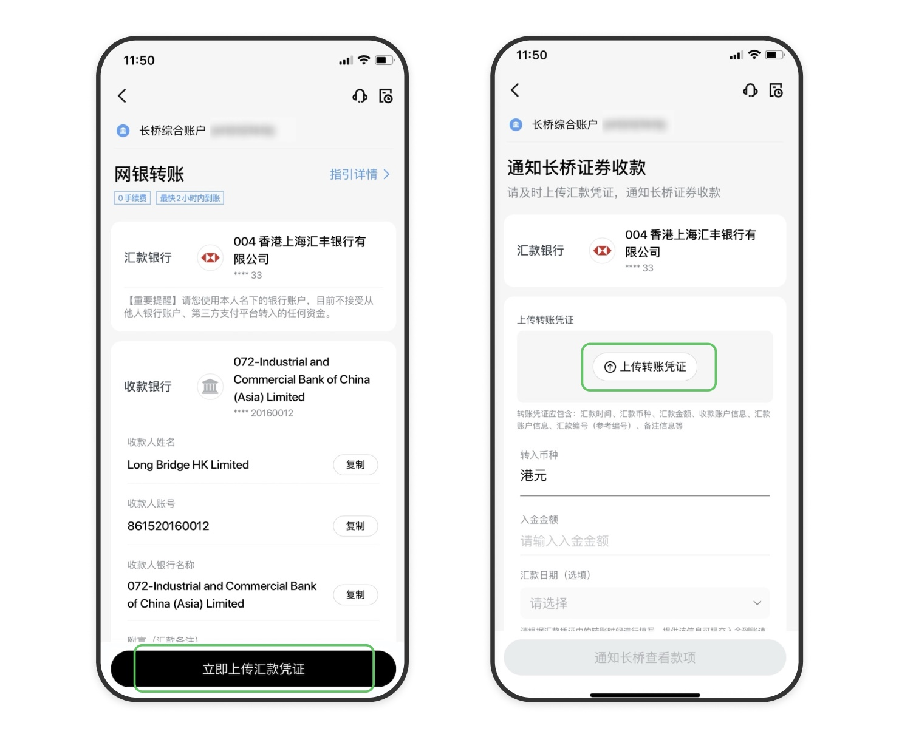
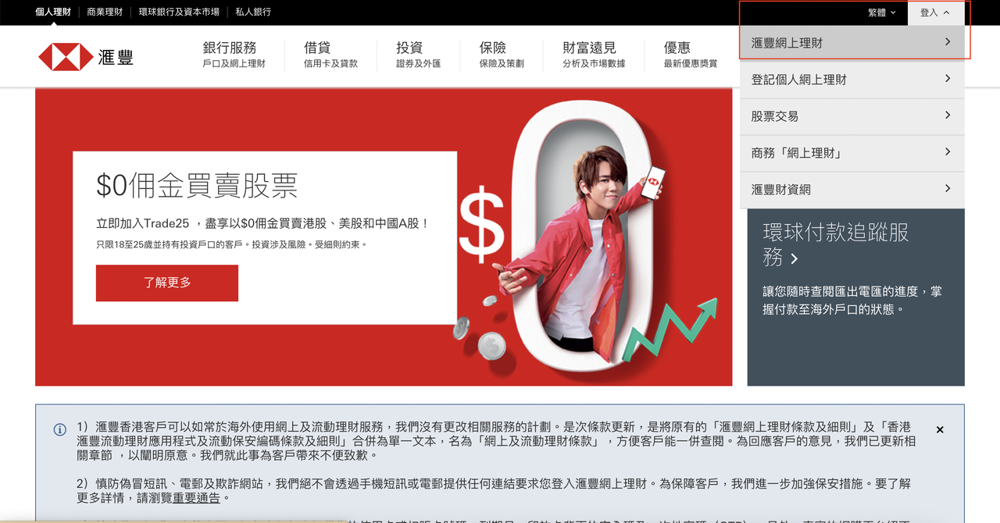
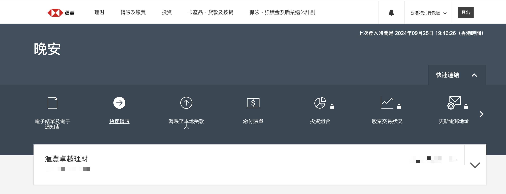
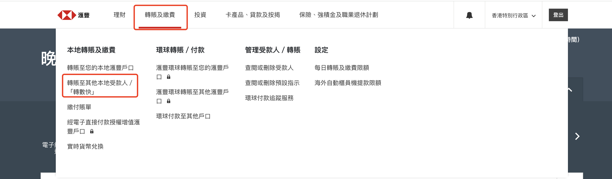
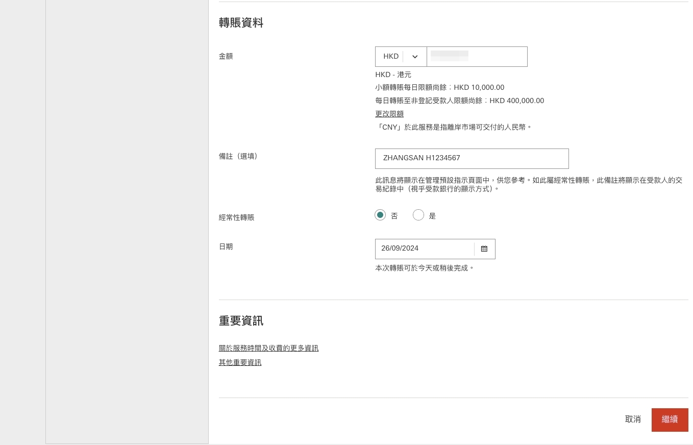
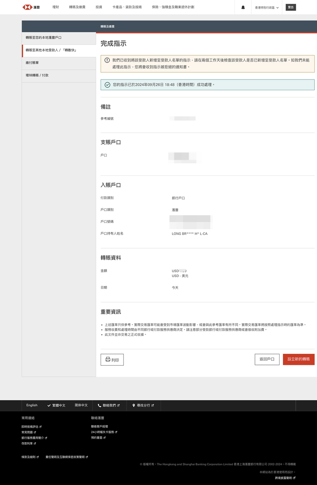

# 汇丰银行网银转账

通过汇丰银行手机银行或网上银行将资金转至长桥，转账完成后上传凭证即可。

汇丰银行有专属收款账户，转账时请使用下方汇丰账号，**勿使用工银亚洲或创兴银行账号**。

网银转账的到账时间、手续费及通用注意事项，见 网银转账入金。

## 收款账户信息（汇丰专属）

| 字段 | 内容 |
| --- | --- |
| 收款人名称 | Long Bridge HK Limited |
| 港元收款账号 | 741733224001 |
| 美元收款账号 | 741733224201 |
| 收款银行 | 香港上海汇丰银行有限公司 |
| 银行编号 | 004 |
| SWIFT 代码 | HSBCHKHHHKH |
| 银行地址 | Level 3 & BL1, HSBC Main Building, 1 Queen’s Road Central, Central, Hong Kong |

## 手机银行

1. 打开**汇丰银行 App** → **转账和缴费** → **其他本地受款人 / “转数快”**，选择收款人

2. 选择汇款银行账户，点击勾选

3. 点击**转账至新受款人** → **选择转账方式**，在下拉弹框中点击**户口号码**

4. 填写收款银行的账户号码，可勾选「新增至受款人名单」，填完后点击**继续**

1. 输入转账金额，生效日期选择**现在生效**，确认提交

2. 立即截图保留凭证，返回**长桥 App** → **资产** → **存入资金** → **网银转账**，上传凭证

## 网上银行

1. 登录**汇丰银行网上理财**，点击右上角**登入 → 汇丰网上理财**

1. 点击**转账及缴费** → **转账至其他本地受款人**

1. 选择转账对象：
	- **首次转账**：选择**转账至新受款人**
	- **再次转账**：选择**选择本地受款人**

2. 填写转账币种和金额，在**备注**填写长桥账号和姓名（如：ZHANGSAN H1234567）
	- 填写备注有助于长桥快速匹配入账。

1. 核对信息，点击**继续**，完成安全验证，提示成功即汇款完毕

1. 立即截图保留凭证，返回**长桥 App** → **资产** → **存入资金** → **网银转账**，上传凭证
	- 凭证必须在汇款完成后立即上传，否则影响入金进度

