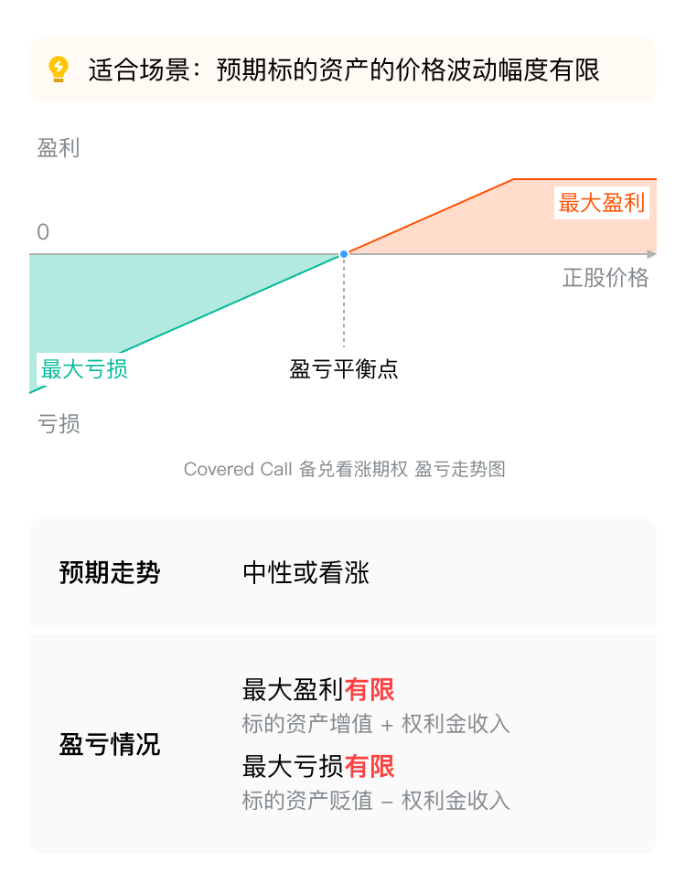
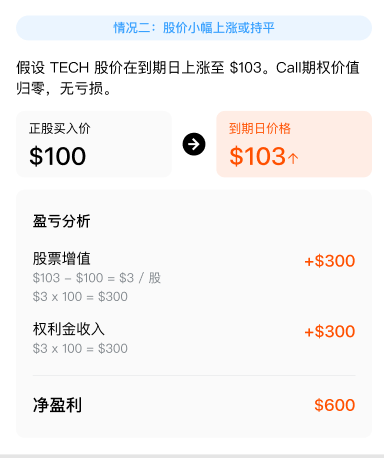
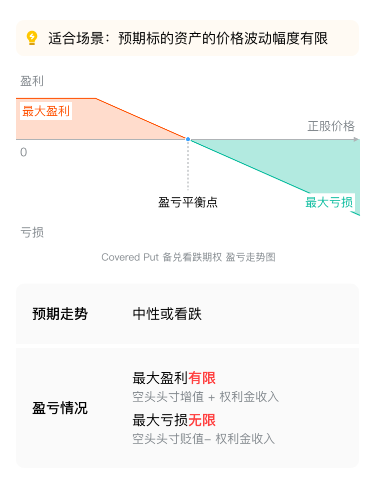
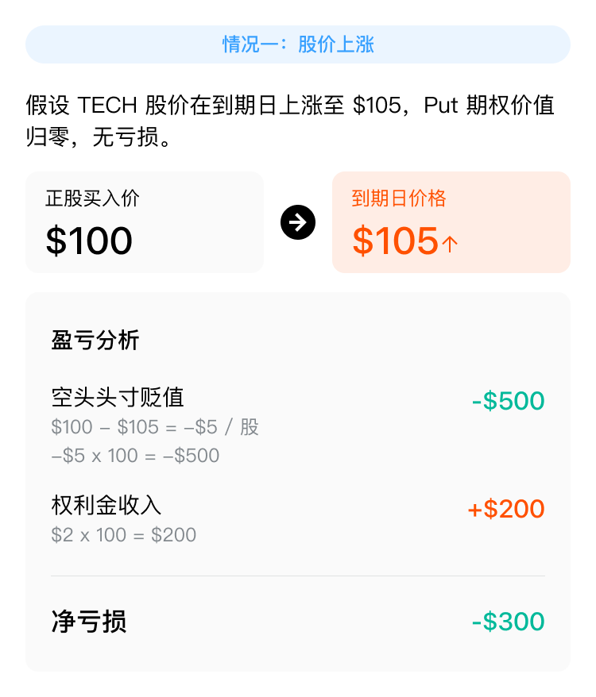
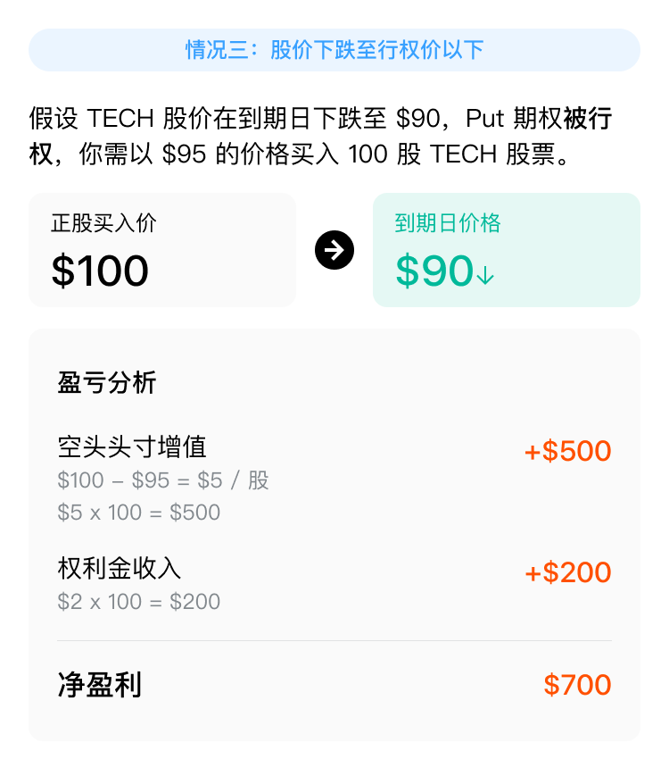
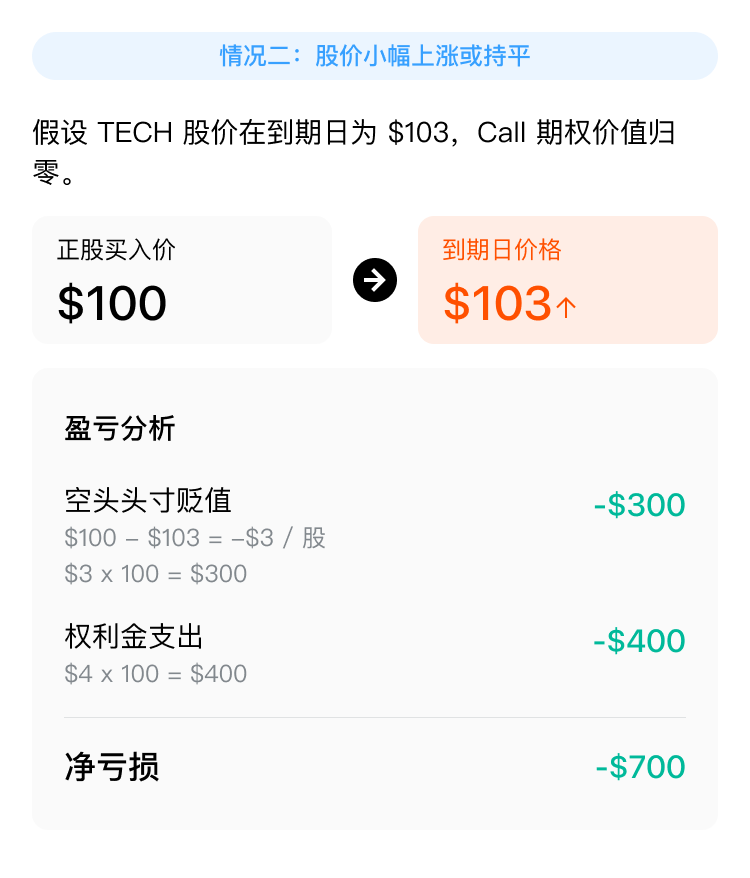

# 股票担保策略

Covered Stock 系列策略包括 Covered Call（备兑看涨）、Covered Put（备兑看跌）、Protective Call（保护性看涨）和 Protective Put（保护性看跌），通过期权与股票头寸的组合，在不同市场环境下管理风险并追求收益。

## Covered Call 备兑看涨期权

### 策略概述

Covered Call 是一种期权策略，通过持有标的资产并同时卖出该标的的看涨期权（Call），来对冲标的资产价格下跌的风险，同时获取额外的权利金收入。该策略适合在预期标的资产价格波动较小的情况下使用。

### 策略特点

Covered Call 策略特点

### 策略构成

Covered Call 策略构成

### 盈利来源

| 标的资产价格 | 盈利来源 |
| --- | --- |
| 上涨 | 股票上涨盈利；卖出看涨期权，收取权利金 |
| 下跌 | 通过权利金，对冲部分损失 |

### 案例解析

以虚构的上市公司 TECH 为例。TECH 当前股价为 $100，预期未来股价波动较小，决定采用 Covered Call 策略：

买入 100 股 TECH 股票，卖出 1 张行权价为 $105 的看涨期权（Call），权利金为 $3。

⚠ 【图片缺失：Covered Call 盈亏图示】

Covered Call 情景分析

Covered Call 盈亏详情

## Covered Put 备兑看跌期权

### 策略概述

Covered Put 是一种期权策略，通过持有标的资产空头头寸并同时卖出该标的的看跌期权（Put），来对冲标的资产价格上涨的风险，同时获取额外的权利金收入。该策略适合在预期标的资产价格波动较小的情况下使用。

### 策略特点

Covered Put 策略特点

### 策略构成

Covered Put 策略构成

### 盈利来源

| 标的资产价格 | 盈利来源 |
| --- | --- |
| 上涨 | 通过权利金，对冲部分损失 |
| 下跌 | 股票下跌盈利；卖出看跌期权，收取权利金 |

### 案例解析

以虚构的上市公司 TECH 为例，假设做空或已持有 100 股 TECH 股票的空头头寸，当前股价为 $100，预期未来股价波动较小，决定采用 Covered Put 策略：

卖出 1 张行权价为 $95 的看跌期权（Put），权利金为 $2。

Covered Put 盈亏图示

⚠ 【图片缺失：Covered Put 情景分析】

Covered Put 盈亏详情

## Protective Call 保护性看涨期权

### 策略概述

Protective Call 是一种期权策略，通过持有标的资产的空头头寸并同时买入该标的的看涨期权（Call），来对冲标的资产价格上涨的风险。该策略适合在预期标的资产价格可能上涨的情况下使用。

### 策略特点

⚠ 【图片缺失：Protective Call 策略特点】

### 策略构成

Protective Call 策略构成

### 盈利来源

| 标的资产价格 | 盈利来源 |
| --- | --- |
| 上涨 | 看涨期权盈利 |
| 下跌 | 股票下跌盈利 |

### 案例解析

以虚构的上市公司 TECH 为例，假设做空或已持有 100 股 TECH 股票的空头头寸，当前股价为 $100，预期未来股价可能上涨，决定采用 Protective Call 策略：

买入 1 张行权价为 $105 的看涨期权（Call），权利金为 $4。

Protective Call 盈亏图示

Protective Call 情景分析

⚠ 【图片缺失：Protective Call 盈亏详情】

## Protective Put 保护性看跌期权

### 策略概述

Protective Put 是一种期权策略，通过持有标的资产多头头寸并同时买入相同标的、相同到期日的看跌期权（Put），来对冲标的资产价格下跌的风险。该策略适合在预期标的资产价格可能下跌的情况下使用。

### 策略特点

⚠ 【图片缺失：Protective Put 策略特点】

### 策略构成

Protective Put 策略构成

### 盈利来源

| 标的资产价格 | 盈利来源 |
| --- | --- |
| 上涨 | 股票上涨盈利 |
| 下跌 | 看跌期权盈利 |

### 案例解析

以虚构的上市公司 TECH 为例，假设购买或已持有 100 股 TECH 股票，当前股价为 $100，预期未来股价可能下跌，决定采用 Protective Put 策略：

买入 1 张行权价为 $95 的看跌期权（Put），权利金为 $3（合约乘数为 100）。

⚠ 【图片缺失：Protective Put 盈亏图示】

Protective Put 情景分析

⚠ 【图片缺失：Protective Put 盈亏详情】

_本文内容仅供参考，不构成任何投资建议。_
