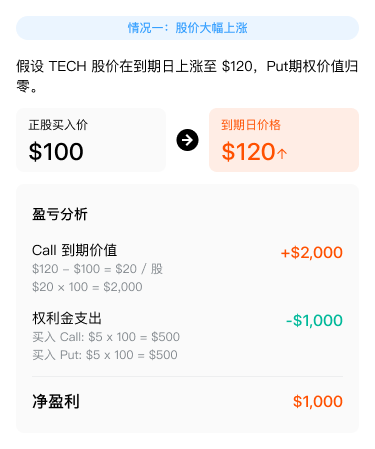
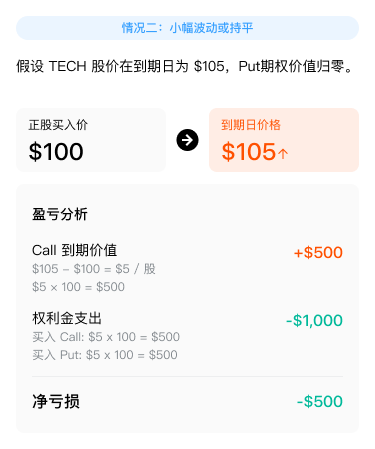
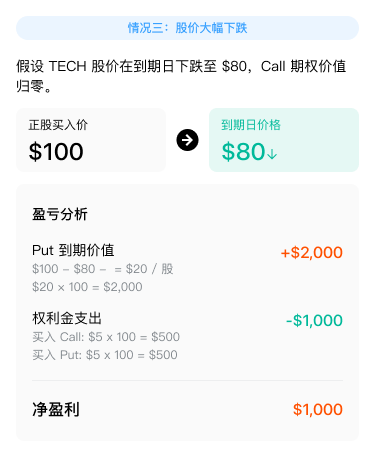
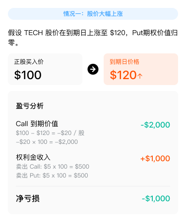
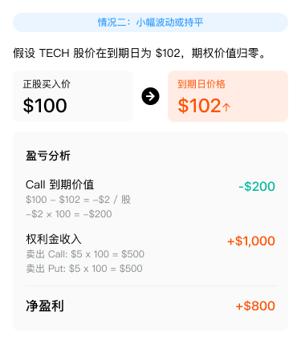
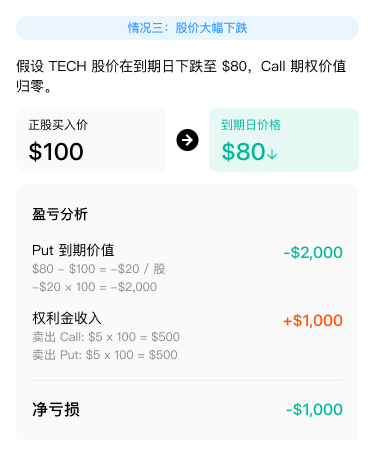

# 跨式策略

Straddle 跨式策略包含 Long Straddle 买入跨式策略与 Short Straddle 卖出跨式策略，是期权交易中基于对市场波动预期进行操作的策略组合。

## Long Straddle 买入跨式策略

### 策略概述

Long Straddle 是一种期权策略，通过同时买入相同标的、相同到期日的看涨期权（Call）和看跌期权（Put），来捕捉标的资产价格的大幅波动。无论标的资产价格上涨还是下跌，只要波动足够大，投资者都能获利。

### 策略特点

⚠ 【图片缺失：Long Straddle 策略特点】

### 策略构成

⚠ 【图片缺失：Long Straddle 策略构成】

### 盈利来源

| 标的资产价格 | 盈利来源 |
| --- | --- |
| 上涨 | 看涨期权盈利 |
| 下跌 | 看跌期权盈利 |

### 案例解析

以虚构的上市公司 TECH 为例，该公司近期因即将发布财报，市场对其股价走势存在较大分歧，预期股价可能出现大幅波动，但方向难以预测，决定采用 Long Straddle 策略：

买入 1 张行权价为 $100 的看涨期权（Call），权利金为 $5；同时买入 1 张行权价为 $100 的看跌期权（Put），权利金为 $5。

Long Straddle 盈亏图示

Long Straddle 情景分析

Long Straddle 盈亏详情

## Short Straddle 卖出跨式策略

### 策略概述

Short Straddle 是一种期权策略，通过同时卖出相同标的、相同到期日的看涨期权（Call）和看跌期权（Put），来捕捉标的资产价格波动较小的场景。该策略适合在标的资产价格预期波动有限的情况下使用，通过收取权利金获取收益。

### 策略特点

⚠ 【图片缺失：Short Straddle 策略特点】

### 策略构成

⚠ 【图片缺失：Short Straddle 策略构成】

### 盈利来源

| 标的资产价格 | 盈利来源 |
| --- | --- |
| 上涨 | 看跌期权收取权利金 |
| 下跌 | 看涨期权收取权利金 |

### 案例解析

以虚构的上市公司 TECH 为例，该公司近期市场环境稳定，股价波动较小，预期未来一段时间内股价将继续保持平稳，决定采用 Short Straddle 策略：

卖出 1 张行权价为 $100 的看涨期权（Call），权利金为 $5；同时卖出 1 张行权价为 $100 的看跌期权（Put），权利金为 $5（合约乘数为 100）。

Short Straddle 盈亏图示

Short Straddle 情景分析

Short Straddle 盈亏详情

_本文内容仅供参考，不构成任何投资建议。_
