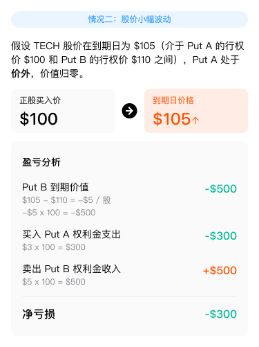
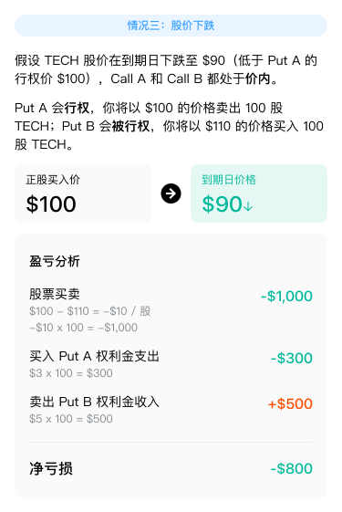
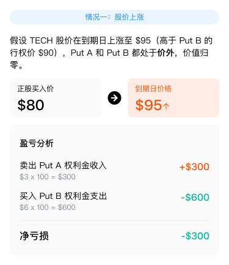
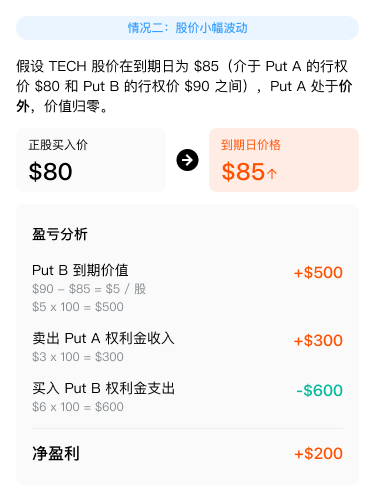

# 垂直价差策略

Vertical Spread 垂直策略包含四种子策略，适用于不同市场预期，通过同时买入和卖出相同标的、相同到期日但不同行权价的期权，在控制风险的同时实现收益目标。

## Bull Call Spread 牛市看涨期权价差

### 策略概述

在预期正股股价将上涨但涨幅有限，或已买入看涨期权（Call）想降低成本及对冲股价下跌风险时使用。通过同时买入一个低行权价的看涨期权（Call A）和卖出一个高行权价的看涨期权（Call B）来构建，两者行权价不同，但标的股票、到期日、方向类型相同。

### 策略特点

Bull Call Spread 策略特点

### 策略构成

Bull Call Spread 策略构成

### 盈利来源

- 「买入 Call A」实现看涨预期，赚取正股上涨收益

- 「卖出 Call B」降低「买入 Call A」的成本

### 案例解析

以虚构的上市公司 TECH 为例，TECH 现价 $100，预期股价将温和上涨但涨幅不大，决定构建 Bull Call Spread 策略：

买入 1 张行权价为 $100 的看涨期权（Call A），权利金为 $4；卖出 1 张行权价为 $110 的看涨期权（Call B），权利金为 $1.5（合约乘数为 100）。

Bull Call Spread 盈亏图示

Bull Call Spread 情景分析

Bull Call Spread 盈亏详情

## Bull Put Spread 牛市看跌期权价差

### 策略概述

在预期正股股价将上涨但涨幅有限，或已买入看跌期权（Put）想降低成本及对冲股价上涨风险时使用。通过同时买入一个低行权价的看跌期权（Put A）和卖出一个高行权价的看跌期权（Put B）来构建，两者行权价不同，但标的股票、到期日、方向类型相同。

### 策略特点

⚠ 【图片缺失：Bull Put Spread 策略特点】

### 策略构成

Bull Put Spread 策略构成

### 盈利来源

- 「卖出 Put B」收取权利金

- 「买入 Put A」限制潜在损失，整体在股价上涨时获利

### 案例解析

以虚构的上市公司 TECH 为例，TECH 现价 $100，预期股价将温和上涨，决定构建 Bull Put Spread 策略：

买入 1 张行权价为 $100 的看跌期权（Put A），权利金为 $3；卖出 1 张行权价为 $110 的看跌期权（Put B），权利金为 $5（合约乘数为 100）。

Bull Put Spread 盈亏图示

Bull Put Spread 情景分析

Bull Put Spread 盈亏详情

## Bear Call Spread 熊市看涨期权价差

### 策略概述

在预期正股股价将下跌但跌幅有限，或已卖出看涨期权（Call）想降低成本及对冲股价上涨风险时使用。通过同时卖出一个低行权价的看涨期权（Call A）和买入一个高行权价的看涨期权（Call B）来构建，两者行权价不同，但标的股票、到期日、方向类型相同。

### 策略特点

⚠ 【图片缺失：Bear Call Spread 策略特点】

### 策略构成

Bear Call Spread 策略构成

### 盈利来源

- 「卖出 Call A」收取权利金

- 「买入 Call B」限制潜在损失，整体在股价下跌时获利

### 案例解析

以虚构的上市公司 TECH 为例，TECH 现价 $190，预期股价将温和下跌，决定构建 Bear Call Spread 策略：

卖出 1 张行权价为 $190 的看涨期权（Call A），权利金为 $4；买入 1 张行权价为 $200 的看涨期权（Call B），权利金为 $2（合约乘数为 100）。

Bear Call Spread 盈亏图示

Bear Call Spread 情景分析

Bear Call Spread 盈亏详情

## Bear Put Spread 熊市看跌期权价差

### 策略概述

在预期正股股价将下跌但跌幅有限，或已买入看跌期权（Put）想降低成本及对冲股价上涨风险时使用。通过同时卖出一个低行权价的看跌期权（Put A）和买入一个高行权价的看跌期权（Put B）来构建，两者行权价不同，但标的股票、到期日、方向类型相同。

### 策略特点

Bear Put Spread 策略特点

### 策略构成

Bear Put Spread 策略构成

### 盈利来源

- 「买入 Put B」在股价下跌时提供保护并赚取收益

- 「卖出 Put A」收取权利金，降低「买入 Put B」的成本

### 案例解析

以虚构的上市公司 TECH 为例，TECH 现价 $80，预期股价将温和下跌，决定构建 Bear Put Spread 策略：

卖出 1 张行权价为 $80 的看跌期权（Put A），权利金为 $3；买入 1 张行权价为 $90 的看跌期权（Put B），权利金为 $6（合约乘数为 100）。

Bear Put Spread 盈亏图示

Bear Put Spread 情景分析

Bear Put Spread 盈亏详情

_本文内容仅供参考，不构成任何投资建议。_
