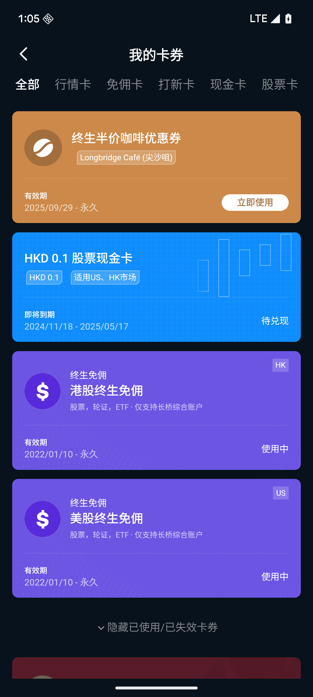

# 我的卡券

「我的卡券」页面用于查看和管理账户内所有持有的卡券。入口在「我的」→「我的卡券」，或「我的」快捷功能栏。

我的卡券全部

## 分类 Tab

页面顶部按卡券类型分 Tab 筛选：

**全部 / 行情卡 / 免佣卡 / 打新卡 / 现金卡 / 股票卡 / 抵扣卡**** / 加息卡 / 咖啡券**

## 卡券列表

每张卡券卡片自上而下/从左到右包含:

| 展示项 | 说明 |
| --- | --- |
| 卡券图标与底色 | 不同类型的卡券有不同图标和颜色(如现金类红色、行情类蓝色、免佣类紫色),方便识别 |
| 卡券名称 | 该卡券的名称,如「打新手续费卡」「30天港股行情卡」 |
| 面值 / 权益内容 | 按卡券类型展示,如金额(「100 HKD」)、时长(「30 天行情」)、权益(「终身免佣」)等 |
| 适用市场标签 | 右上角小标签,标明适用市场,如 HK(港股)、US(美股) |
| 剩余次数 | 仅按次使用的卡券(免佣次卡、平台费抵扣卡)显示,如「剩余 3/5 次」 |
| New 角标 | 新到账的卡券会带「New」圆形角标 |
| 使用说明摘要 | 一句话使用条件,如「仅适用于正股」「仅限咖啡空间使用」 |
| 有效期 | 显示可使用的起止日期,如「有效期 2026.01.01 - 2026.03.31」 |
| 即将过期提醒 | 距离过期不足一定天数时,显示「即将过期」提示;最后一天会显示倒计时 |
| 状态/操作按钮 | 右下角:可操作时显示按钮(如「立即使用」),不可操作时显示状态文字(如「已使用」) |
| 状态水印 | 已使用、已失效的卡券整体置灰,并在卡片右下角加「已使用」/「已失效」水印 |

点击卡片可进入**卡券详情页**,查看:卡券类型、名称、卡券编号、完整有效期、详细使用规则说明;部分卡券(免佣卡、抵扣卡、咖啡券等)还有「使用记录」页签,可查看每次使用/抵扣明细。

## 卡券状态说明(核心)

客户在卡券右下角看到的状态文字,按卡券类型略有差异:

### 1️⃣ 待使用(可使用)

**含义**:卡券已发放到账,尚未使用,在有效期内可正常使用。

**卡片表现**:卡片彩色高亮,带可点击的操作按钮。

**按钮文案因类型而异，部分卡券展示 待使用、激活等**

### 2️⃣ 使用中

**含义**:卡券已激活,权益正在生效中(常见于持续生效型卡券:行情卡、免佣卡、融资利息卡、基金加息卡等)。

**卡片表现**:正常显示,右下角显示状态文字。

**按钮文案因类型而异，部分卡券展示 使用中、待加息等**

### 3️⃣ 处理中 / 锁定中

**含义**:卡券正在被一笔业务占用或处理,期间不能再次使用,等处理完成后状态会自动更新。

**卡片表现**:正常显示,状态文字灰色、不可点击。

**按钮文案因类型而异，部分卡券展示 锁定中、处理中等**

### 4️⃣ 已使用

**含义**:卡券已核销完成,权益已兑现,不可再次使用。

**卡片表现**:整体置灰(半透明),右下角有「已使用」水印,收纳在隐藏区域。

**按钮文案因类型而异，部分卡券展示 已使用等**

### 5️⃣ 已过期 

**含义**:卡券超过有效期截止时间仍未使用,自动失效,无法再使用,也无法恢复。

**卡片表现**:整体置灰,右下角有「已失效」水印,收纳在隐藏区域。

**按钮文案因类型而异，部分卡券展示 已过期等**

## 隐藏已失效卡券

页面底部「隐藏已使用/已失效卡券」开关，默认隐藏。展开后可查看所有隐藏卡券记录。
