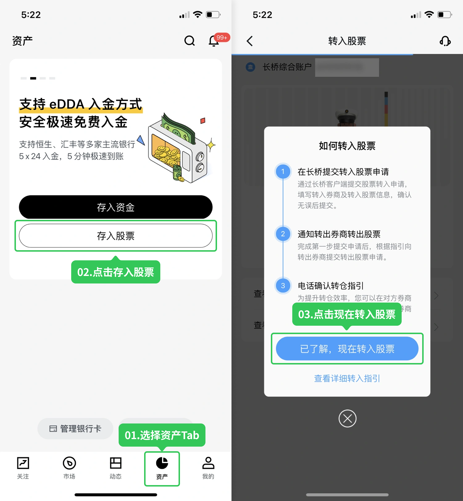
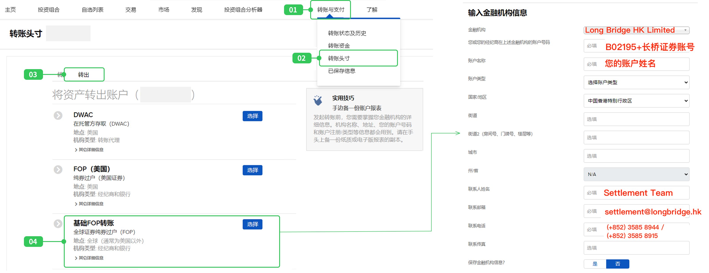
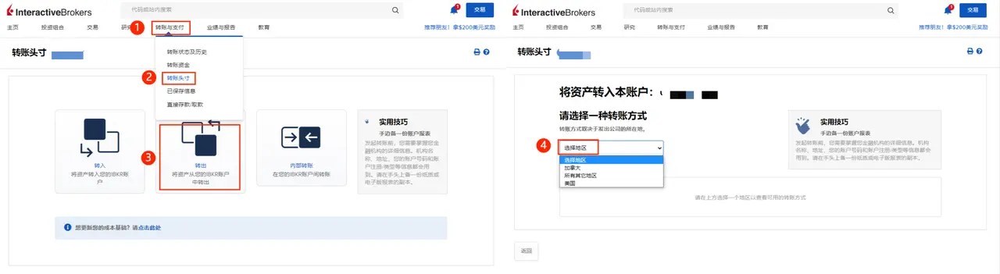
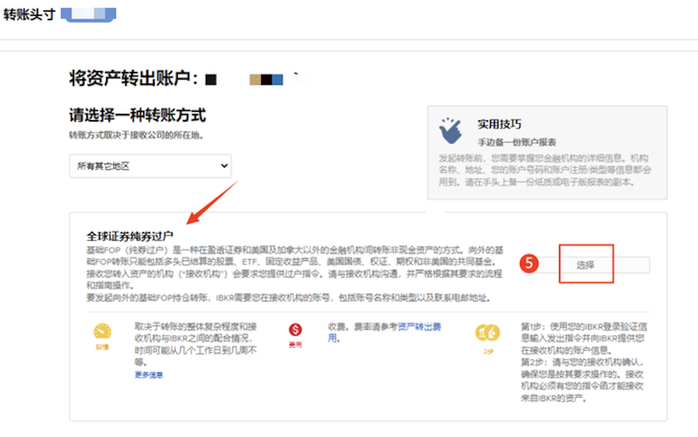
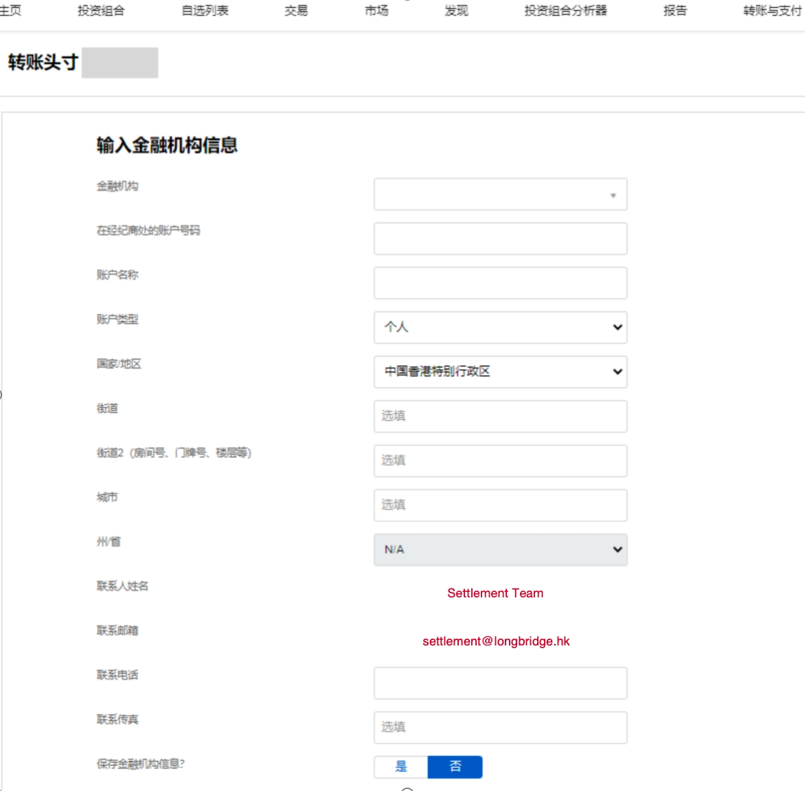

# 从盈透证券 (IB) 转仓

从盈透证券（IB）转入股票，**港股和美股流程完全不同**，请根据转入股票类型分别操作。

**适用范围**：IB 个人账户。雪盈证券（底层为 IB）操作类似但有差异，请参考 从雪盈证券转仓到长桥证券。老虎证券用户请参考 从老虎证券转仓到长桥证券。

美股转仓指示确认后，完成时间一般为 **3–6 周**，远长于其他券商，请提前安排。

转入长桥不收费；转出费用由 IB 收取。

## 第一步：在长桥提交转入申请

1. 打开**长桥 App** → **资产** → **存入股票** → **提交转入申请**；或进入**资产 → 全部功能 → 转入股票**

存入股票入口

全部功能 → 转入股票

1. 转出券商选择**盈透证券**，填写账户姓名和账户号码，点击**下一步**，填写股票信息后提交

- 长桥支持填写每股成本价（选填）。未填写时按转仓成功当日收盘价计算；填写后无法修改。

## 第二步：在 IB 官网提交转出指示

登录 [IB 官网](https%3A%2F%2Fwww.interactivebrokers.com.hk%2Fcn%2Fhome.php)，按股票市场选择对应流程：

### 转出港股（基础 FOP 转账）

1. 路径：**转账与支付** → **转账头寸** → **转出** → **基础 FOP 转账**

基础 FOP 转账路径

1. 填写以下长桥接收方信息：

| 字段 | 内容 |
| --- | --- |
| 金融机构 | Long Bridge HK Limited |
| 您在上述机构的账户号码 | 您的长桥证券账户号码（H 开头） |
| 账户名称 | 您的账户姓名（英文） |
| 联系人姓名 | Settlement Team |
| 联系电话 | (+852) 3585 8944 / (+852) 3585 8915 |
| 联系邮箱 | settlement@longbridge.hk |

完成后耐心等待，双方券商确认后开始转移。

### 转出美股（全球证券纯券过户）

1. 路径：**转账与支付** → **转账头寸** → **转出** → **选择地区**

选择地区

1. 选择**所有其他地区** → 选择**全球证券纯券过户**

选择全球证券纯券过户

1. 填写以下长桥接收方信息：

| 字段 | 内容 |
| --- | --- |
| 接收券商名称 | Long Bridge HK Limited |
| DTC 代码（参与者代号） | DTC 0534 |
| 接收账户 | 您的长桥证券账户号码（H 开头） |
| 联系人 | Settlement Team |
| 联系人电话 | (+852) 3585 8944 / (+852) 3585 8915 |
| 联系人邮箱 | settlement@longbridge.hk |

填写接收方信息

1. 提交申请后，**部分用户**会收到 IB 通知需提供授权书，按实际情况处理，填写后提交

授权书示例

完成后耐心等待，一般需要 **3–6 周**完成转仓。如需跟进，可联系 IB 客服：

| 渠道 | 联系方式 | 服务时间 |
| --- | --- | --- |
| IB 上海客服 | +86 (21) 6086 8586 | 周一至周五 09:00–18:00 |
| IB 香港客服 | +852-2156-7907 | 周一至周五 08:00–17:00 |
