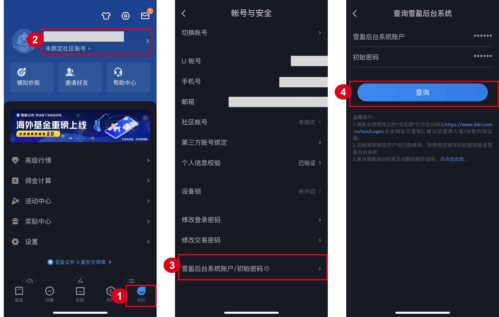
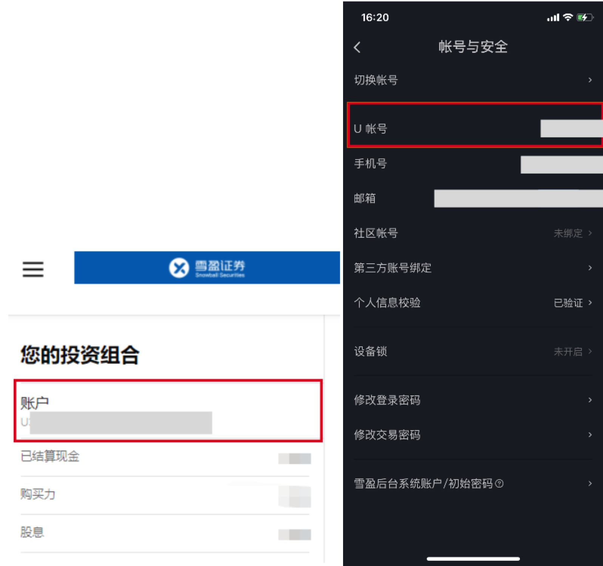
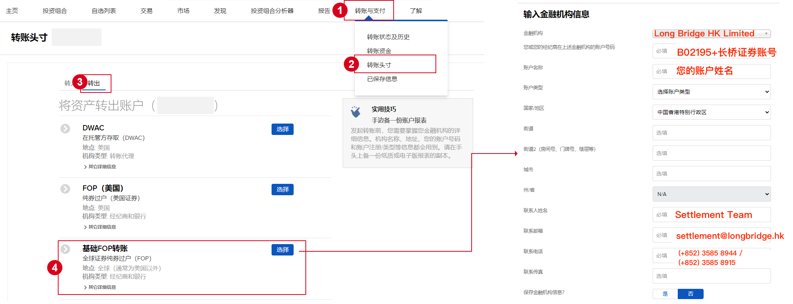
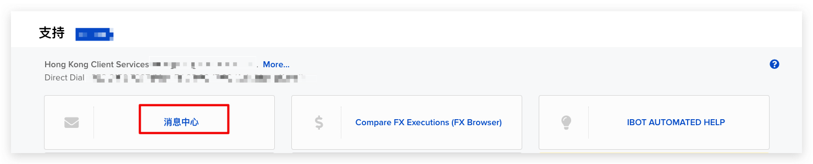
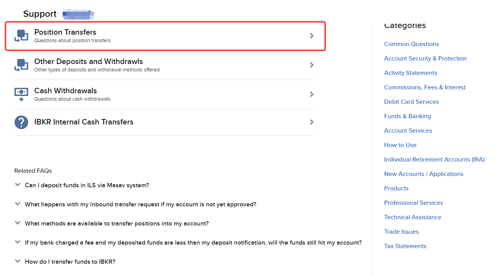
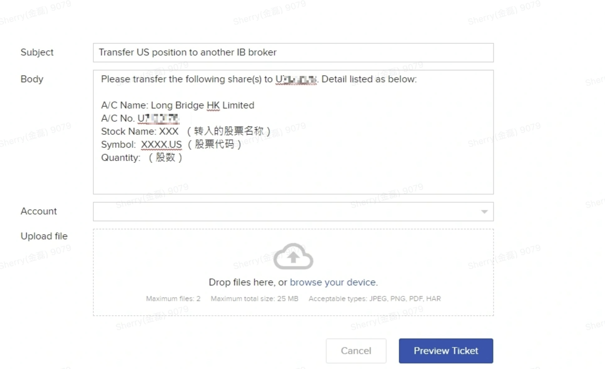

# 从雪盈证券转仓

雪盈证券底层基于 IB（盈透证券），操作流程与 IB 相同，但有两点不同：长桥中选择**雪盈证券**，且需从雪盈 App 获取 IB 账号和初始密码。

转入长桥不收费；转出费用由雪盈证券收取。

## 第一步：在长桥提交转入申请

1. 打开**长桥 App** → **资产** → **存入股票** → **提交转入申请**；或进入**资产 → 全部功能 → 转入股票**

1. 转出券商选择**雪盈证券**，填写账户姓名和账户号码，填写股票信息后提交
	- 长桥支持填写每股成本价（选填）。未填写时按转仓成功当日收盘价计算；填写后无法修改。

## 第二步：获取 IB 账号

1. 在雪盈证券 App → **我的** → **账户** → **雪盈后台系统账户/初始密码**，查询 IB 登录账号和初始密码。

1. 从雪盈 App 获取 IB 账号

2. 登录 [IB 官网](https%3A%2F%2Fwww.interactivebrokers.com.hk%2Fcn%2Fhome.php)，使用雪盈后台账号登录（若已设新密码则用新密码；密码有误可通过「忘记密码」或致电 IB 021-60868586 找回）。

3. 登录后在投资组合栏查看 IB 账号（U 开头），也可在雪盈 App 账户页查看 U 账号。

## 第三步：在 IB 提交转出指示

### 港股（基础 FOP 转账）

路径：**转账与支付** → **转账头寸** → **转出** → **基础 FOP 转账**

| 字段 | 内容 |
| --- | --- |
| 金融机构 | Long Bridge HK Limited |
| 账户号码 | B02195 + 您的长桥账号（如 B02195+H1234567） |
| 账户名称 | 您的账户姓名（英文） |
| 联系人 | Settlement Team |
| 联系电话 | (+852) 3585 8944 / (+852) 3585 8915 |
| 联系邮箱 | settlement@longbridge.hk |

### 美股（IB 消息中心）

1. 在 IB 账户右上角选择**帮助** → **支持中心** → **消息中心**

1. **撰写** → **新咨询单** → **Funds & Banking** → **Position Transfers**

1. 按以下模板填写咨询单后点击 **Preview Ticket**：

填写咨询单

- Subject: Transfer US position to another IB broker

- Body:
Please transfer the following share(s) to U11928885. Detail listed as below:
A/C Name: Long Bridge HK Limited
A/C No. U11928885
Stock Name: [股票名称]
Symbol: [股票代码].US
Quantity: [股数]
Settlement Date: [提交当日 +1 天]
No change in beneficial owner
Account: [您的 IB 账户，U 开头]

结算日期建议填写提交当日 +1 天。

1. 提交后 IB 生成 ticket number，**请将该 ticket number 告知长桥客服**

2. **部分用户**会收到 IB 通知需提供授权书，填写后提交

IB 客服：上海 +86 (21) 6086 8586（周一至周五 09:00–18:00）；香港 +852-2156-7907（周一至周五 08:00–17:00）

完成后耐心等待，股票转出后将在 **1–2 个工作日**存入长桥账户。
